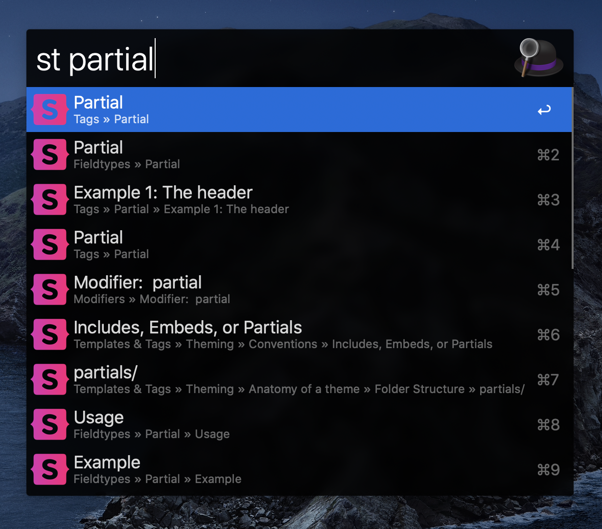

# Statamic Docs Workflow for Alfred

A fast Statamic docs search workflow for Alfred.

Adapted from [Tailwind CSS Docs](https://github.com/clnt/alfred-tailwindcss-docs), which is adapted from [Alfred VueJS Docs](https://github.com/vmitchell85/alfred-vuejs-docs), which is adapted from [Alfred Laravel Docs](https://github.com/tillkruss/alfred-laravel-docs).


## Installation

1. [Download the latest version](https://github.com/bryantgillespie/alfred-statamic-docs/releases/download/2.0/Statamic.Docs.alfredworkflow)
2. Install the workflow by double-clicking the `.alfredworkflow` file
3. You can add the workflow to a category, then click "Import" to finish importing. You'll now see the workflow listed in the left sidebar of your Workflows preferences pane.

## Usage

Just type `st` followed by your search query to search the V3 docs.

If you still need the V2 docs, no worries.
Just type `v2` to search them.

```
st <query>
```


